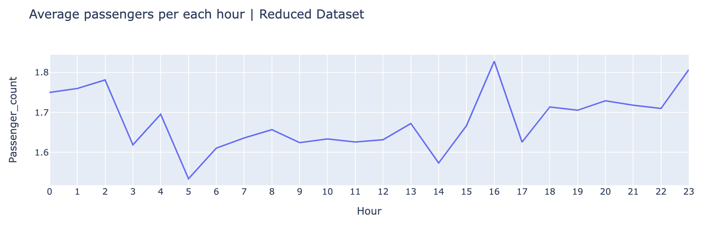

# **Taxi Data Analysis - IA626**
#### by Rakesh Kantharaju


### Intro

In this project we will analyze a dataset which contains information about taxi rides in NYC.  The data set is quite large so getting a basic idea of what the data contains is important.  Each student should use one of the CSV files 


### Data Info

We will be answering few question regarding the dataset but before that lets read the data and print the sample data, and their headers and rows.

```
f=open("trip_data_1.csv",'r')
r=csv.reader(f)
n=0
for row in r:
    print(row)
    print(type(row))
    n+=1
    if n>5:
        break
```
The above code opens the `taxi_data_1.csv` file in read mode, since that data is comma seperated we will be using `csv.reader()` function to read the file and print top 5 rows using for loop.


As we can see each row is a list here and all items in the list are string datatypes.First row has all the columns,lets list out all the columns and their definitions below.

* **medallion** : permits allowing an individual or company to operate a taxicab
* **hack_licence** : driver's license
* **vendor_id** : company id which opereates the Taxi
* **rate_code**: type of fare that is applied for that ride
* **store_and_fwd_flag** : This flag indicates whether the trip record was held in vehicle memory before sending to the vendor because the vehicle did not have a connection to the server — Y=store and forward; N=not a store and forward trip
* **pickup_datetime** : datetime when the passenger was picked up
* **dropoff_datetime** : datetime when the passenger was dropped off
* **passenger_count** : count of passengers in each ride
* **trip_time_in_secs** : total time in seconds to drop the passsenger from pickup location to destination 
* **trip_distance** : distance of the trip
* **pickup_longitude** : longitude coordinate of the pickup location
* **pickup_latitude** : latitude coordinate of the pickup location
* **dropoff_longitude** : longitude coordinate of the dropoff location
* **dropoff_latitude** : latitude coordinate of the dropoff location

### Before getting started with questions lets import required packages first for our analysis

- csv : to read the csv file
- math : for mathematical operations like floor, ceil
- seaborn and matplotlib : to plot graphs
- datetime : to convert to datetime object in our analysis
- time : to track the time taken for the code to run
- pprint : to print a dictionary in readable format

```
import csv
import math
import seaborn as sns     
sns.set()
import matplotlib.pyplot as plt
%matplotlib inline
import datetime as dt
import time
import pprint
```


## Lets answer the following questions

### 1. What datetime range does your data cover?  How many rows are there total?

There are two parts in this question
1. datetime range of the data
2. how many rows

- As we know the datatypes in each row is string datatype , we need to convert pickup_datetime from string to datetime, to do this we use ```datetime``` library.
-  ```time``` library is to calculate how long did the code take to get the results.
- d is a list created to capture all the datetimes in one collection
- total_rows is the variable created to keep track of number of rows as we iterate
- We iterate through each row and we skip the first row because they are headers/column names.
- using ```strptime()``` function we change datatypes of pickup_datetime to datetime and append to the list d that we created.
- increment total_rows to capture how many rows its has iterated.
- one you iterate through all rows , you will have a list of all pickup_datetimes and total_rows
- we simply use min and max function to get the daterange from the list that we created.

***code***

```

start=time.time()
total_rows=0
d=[]
f=open("trip_data_1.csv",'r')
r=csv.reader(f)
total_rows=0

for row in r:
    if total_rows!=0:
        pickup_date=dt.datetime.strptime(row[5],"%Y-%m-%d %H:%M:%S")
        d.append(pickup_date)
    total_rows+=1
print("Total Rows: ",total_rows)
print("Datetime Range: from {a} to {b}".format(a=min(d),b=max(d)))
print("Time taken:",time.time()-start)

```


***output***


***ANS: The datetime range for this data is from Jan 1 2023 to Jan 31 2023 and it took almost 57 seconds to iterate over 14.7 million rows***

### 2. What are the field names? Give descriptions for each field?

***code***
```
f=open("trip_data_1.csv",'r')
r=csv.reader(f)
for row in r:
    print("Field Names:",*row,sep='\n-')
    break
```
Printing the top row values which are our field names line by line

***output***


***ANS:***

Definitions:
* **medallion** : permits allowing an individual or company to operate a taxicab
* **hack_licence** : driver's license
* **vendor_id** : company id which opereates the Taxi
* **rate_code**: type of fare that is applied for that ride
* **store_and_fwd_flag** : 
* **pickup_datetime** : datetime when the passenger was picked up
* **dropoff_datetime** : datetime when the passenger was dropped off
* **passenger_count** : count of passengers in each ride
* **trip_time_in_secs** : total time in seconds to drop the passsenger from pickup location to destination 
* **trip_distance** : distance of the trip
* **pickup_longitude** : longitude coordinate of the pickup location
* **pickup_latitude** : latitude coordinate of the pickup location
* **dropoff_longitude** : longitude coordinate of the dropoff location
* **dropoff_latitude** : latitude coordinate of the dropoff location

### 3. Give some sample data for each field?

We can print sample data of each field in many ways.Lets try one 
```
f=open("trip_data_1.csv",'r')
r=csv.reader(f)
n=0

for row in r:
    print(*row,sep=" | ")
    n+=1
    if n>5:
        break
```


I have used ```unpacking operator *``` along with "|" seperator to print the first 5 rows using counter variable n.
As we can see the sample data is difficult to interpret.
We can display sample data in a better way using pandas but since we are not using pandas lets try dictionaries.

```
import pprint
f=open("trip_data_1.csv",'r')
r=csv.reader(f)

keys=next(r)
values=[]
n=0
for row in r:
    if n>0:
        values.append(row)
    n+=1
    if n>5:
        break

my_dict = {key: value for key, *value in zip(keys, *values)}
pprint.pp(my_dict)

```


This can be interepreted well comapred to our previous one where each key is a field and values are its sample rows.
I have used the top row to create the keys and rest of the rows as values for respective keys.
To get the top row I have used ```next()``` function which gets the top row and using a for loop I have taken rest of the rows as values. Using ```zip()``` function I have created a dictionary which combines keys and transposed version of values.

### 4. What MySQL data types / len would you need to store each of the fields? int(xx), varchar(xx),date,datetime,bool, decimal(m,d)

***ANS:***

*Field Names and their datatypes:*
- **medallion**          : VARCHAR(500)
- **hack_license**      : VARCHAR(500)
- **vendor_id**     : VARCHAR(500)
- **rate_code**        : INT
- **store_and_fwd_flag** : VARCHAR(10)
- **pickup_datetime**   : DATETIME
- **dropoff_datetime**   : DATETIME
- **passenger_count**    : INT
- **trip_time_in_secs**  : INT
- **trip_distance**      : decimal(6,2)
- **pickup_longitude**   : decimal(10,6)
- **pickup_latitude**    : decimal(10,6)
- **dropoff_longitude**  : decimal(10,6)
- **dropoff_latitude**   : decimal(10,6)

### 5. What is the geographic range of your data (min/max - X/Y)? Plot this (approximately on a map)

Inorder to solve this problem we need to find the below four data points in map 
- minimum latitude value 
- maximum latitude value 
- minimum longitude value
- maximum longitude value 

from the pickup and dropoff latitude and longitudes

We need to explore the coordinates data inorder to see if they are right.There are multiple ways to check if a coordinates in the given row is right.


- The first step is to iterate through all the rows in the data and try to convert the coordinates to float data type.
Try block works fine if there are non-string elements and throws an exception when string data shows up.We are interested only in the correct numbers.
- We know that latitude values range from -90 to +90 whereas longitude values range from -180 to +180.Therefore we can check if the coordinates fall under this range.
- There are issues even after this. for example: even after the row falls under above range, there might be sign issues and incorrect coordinate values. How do we validate this?
- We have another field that we can use to validate the coordinates, that is "trip_distance". We can use haversine_distance() to calculate the distance using the coordinates and compare it with "trip_distance". If the absolute value of this output falls between 1 or 2 we can consider that row. This methods excludes most of the rows with different incorrect coordinate values.
- Remember we should also consider "trip_distance" greater than 0.
- We also have min and max for latitude and longitude values for United States of America therefore we can also use this in our condition to make sure the coordinates are right
- latitude range (24-47) and longitude range (-121,-69)

Now lets start coding

Read the dataset and initialize min amd max values for pickup latitude,longitude values and dropoff latitude and longitude values.

```
f=open("trip_data_1.csv",'r')
r=csv.reader(f)
n=0


max_pickup_lat_value = float('-inf')
max_dropoff_lat_value = float('-inf')

max_pickup_long_value = float('-inf')
max_dropoff_long_value = float('-inf')

min_pickup_long_value = float('inf')
min_dropoff_long_value = float('inf')

min_pickup_lat_value = float('inf')
min_dropoff_lat_value = float('inf')

incorrect_values=0 # to count incorect rows with outofrange values , not necessary for this problem
blank=0 # to count blanks , not necessary for this problem


```

Now lets iterate through each row and follow the steps mentioned above.In the try block we try to convert the string type coordinate to float type and then once it is successfully converted , we use them to calculate haversine distance to compare it with actual distance.

Next we use the if condition to check if the lat lon falls under their range. If not we increment incorrect_value variable by 1.Else we compare haversine distance with actual distance along with USA coordinate range to calculate the min max value.

Haversine_distance function

```
from math import radians, sin, cos, sqrt, atan2

def haversine_distance(lat1, lon1, lat2, lon2):
    lat1, lon1, lat2, lon2 = map(radians, [lat1, lon1, lat2, lon2])

    # Haversine formula
    dlat = lat2 - lat1
    dlon = lon2 - lon1
    a = sin(dlat / 2) ** 2 + cos(lat1) * cos(lat2) * sin(dlon / 2) ** 2
    c = 2 * atan2(sqrt(a), sqrt(1 - a))

    # Radius of Earth in kilometers (you can use 6371.0 km for distance in km)
    radius = 3958.8

    # Calculate the distance
    distance = radius * c

    return distance
```

```
for row in r:
    if n!=0:
        try:
            long1=float(row[10])# pickup_longitude
            lat1=float(row[11])# pickup_latitude
            long2=float(row[12])# dropoff_longitude
            lat2=float(row[13])# dropoff_latitude
            
            h_distance=math.floor(haversine_distance(lat1,long1,lat2,long2))
            act_distance=math.floor(float(row[9]))
            
            if ((round(abs(long1)) not in range(1,180)) or (round(abs(long2)) not in range(1,180)) or 
                (round(abs(lat1)) not in range(1,90)) or (round(abs(lat2)) not in range(1,90))):
                incorrect_values+=1
            
            else:


                if (((act_distance>0) and (abs(h_distance-act_distance) <2)) and 
                    ((int(lat1) in range(24,47)) and (int(lat2) in range(24,47)) and 
                    (int(long1) in range(-121,-69)) and (int(long2) in range(-121,-69)))):
                                
                    pickup_long_values=long1
                    pickup_lat_values=lat1
                    dropoff_long_values=long2
                    dropoff_lat_values=lat2

                    max_pickup_lat_value=max(pickup_lat_values,max_pickup_lat_value)
                    max_dropoff_lat_value=max(dropoff_lat_values,max_dropoff_lat_value)

                    min_pickup_lat_value=min(pickup_lat_values,min_pickup_lat_value)
                    min_dropoff_lat_value=min(dropoff_lat_values,min_dropoff_lat_value)


                    max_pickup_long_value=max(pickup_long_values,max_pickup_long_value)
                    max_dropoff_long_value=max(dropoff_long_values,max_dropoff_long_value)

                    min_pickup_long_value=min(pickup_long_values,min_pickup_long_value)
                    min_dropoff_long_value=min(dropoff_long_values,min_dropoff_long_value)
                  
        except Exception as e:
            blank+=1
            
    n+=1
    
```

Lets print the values
```
print("Latitude Range: {} to {}".format(min(min_pickup_lat_value, min_dropoff_lat_value), max(max_pickup_lat_value, max_dropoff_lat_value)))
print("Longitude Range: {} to {}".format(min(min_pickup_long_value, min_dropoff_long_value), max(max_pickup_long_value, max_dropoff_long_value)))
  
```


***ANS:***

Using the above coordinates lets plot the range data in https://geojson.io/


Tada, we have the geographic range of our data.


### 6. What is the average computed trip distance? (You should use Haversine Distance)


We have defined  haversine_distance() function in the previous question, therefore we will just use it here.

Lets create two lists h_distance and actual_distance.
- h_distance : this list captures distance calculated by haversine method using latitude and longitude values
- actual_distance : this list captures the actual true distance value mentioned in the dataset. I have used this to validate the h_distance that we calculate.

Once we have all the distance value in the lists we calculate the average distance.

```
f=open("trip_data_1.csv",'r')
r=csv.reader(f)
h_distance=[]
actual_distance=[]
n=0
for row in r:
    if (n!=0) and (row[10]!='') and (row[11]!='') and (row[12]!='') and (row[13]!=''):
        h_distance.append(haversine_distance(float(row[11]),float(row[10]),float(row[13]),float(row[12])))
        actual_distance.append(float(row[9]))
    n+=1

print("Average computed trip distance using haversine_distance: {} miles".format(round(sum(h_distance)/len(h_distance),0)))
print("Average computed trip distance using trip_distance column: {} miles".format(round(sum(actual_distance)/len(actual_distance),0)))

```


From the output that we see, we can say that there is something wrong with our coordinates data, therefore lets investigate.


We can list out the possible issues and do a check
- check if all coordinate values fall in range of latitudes and longitudes, if not increment incorrect value by 1 else correct value by 1. 
- There might be blanks in coordinate values.If the try block doesnt work that means there are blanks or strings that cannot be converted to float. In this case I increment blank by 1.

```
f=open("trip_data_1.csv",'r')
r=csv.reader(f)

n=0

incorrect_values=0
correct_values=0
blanks=0

for row in r:
    if n!=0:
        try:
            long1=float(row[10])# pickup_longitude
            lat1=float(row[11])# pickup_latitude
            long2=float(row[12])# dropoff_longitude
            lat2=float(row[13])# dropoff_latitude
            
            if ((round(abs(long1)) not in range(1,180)) or (round(abs(long2)) not in range(1,180)) or 
                (round(abs(lat1)) not in range(1,90)) or (round(abs(lat2)) not in range(1,90))):
                incorrect_values+=1
        
            else:
                correct_values+=1
                
        except Exception as e:
            blanks+=1
            
    n+=1

print("Total rows : {}".format(total_rows))
print("Rows with incorrect_values:",incorrect_values)
print("Rows with blanks:",blanks)
print("Total rows with incorrect coordinates : {} ".format(incorrect_values+blanks))
print("Percentage of incorrect values : ",round(((incorrect_values+blanks)/total_rows)*100,0),"%")

```


From the output we can see 2% of the rows have incorrect coordinates, which is not much compared to the whole dataset.

Now using the same above code lets calculate haversine_distance for the rows with right coordinate values and calculate distance using the actual trip_distance value.

```
# for git
f=open("trip_data_1.csv",'r')
r=csv.reader(f)
n=0

incorrect_values=0
correct_values=0
blank=0

h_distance=[]
actual_distance=[]


for row in r:
    if n!=0:
        try:
            long1=float(row[10])# pickup_longitude
            lat1=float(row[11])# pickup_latitude
            long2=float(row[12])# dropoff_longitude
            lat2=float(row[13])# dropoff_latitude
            
            if ((round(abs(long1)) not in range(1,180)) or (round(abs(long2)) not in range(1,180)) or 
                (round(abs(lat1)) not in range(1,90)) or (round(abs(lat2)) not in range(1,90))):
                incorrect_values+=1
        
            else:
                correct_values+=1
                h_distance.append(haversine_distance(float(row[11]),float(row[10]),float(row[13]),float(row[12])))
                actual_distance.append(float(row[9]))
                
        except Exception as e:
            blank+=1
            
    n+=1
print("Total_rows : {}".format(total_rows))
print("Rows with incorrect coordinates : {} ".format(incorrect_values+blank))
print("Percentage of incorrect values : ",round(((incorrect_values+blank)/total_rows)*100,0),"%")
print("Average computed trip distance using haversine_distance: {} miles".format(round(sum(h_distance)/len(h_distance),2)))
print("Average computed trip distance using trip_distance column: {} miles".format(round(sum(actual_distance)/len(actual_distance),2)))

```


As we can now see the average computed trip distance calcualated using haversine method and actual trip_distance field is approxmiately macthing.

***ANS*** 

Therefore, we can conclude that the Average trip distance is 2-3 miles.

### 7. Draw a histogram of the trip distances binned anyway you see fit.

- We can use histogram function from plotly to plot trip_distances captured in the td list by iterating through all the rows.
- We can see that most the trip distance were between 0-20 and few between 20-100.
- We are noticing 0 trip distances which shouldnt be the case therefore we should not include the rows with 0 trip_distance.
- Let plot another histogram removing rows with 0 trip distance and include rows trip distance less than 40.

```
import plotly.express as px

f=open("trip_data_1.csv",'r')
r=csv.reader(f)
td=[]
n=0
for row in r:
    if n!=0:
        td.append(float(row[9]))
    n+=1
    
fig = px.histogram(td,
                   nbins=100, 
                   title="Trip Distance", 
                   labels={'value': 'Distance (miles)', 'count': 'Frequency'},
                  legend=False)

fig.show()
```


Since we have very negligible rows with distance >40 miles lets plot another graph having a bin range (1,30) and also trip_distance cannot be 0.

```
sns.histplot(td,kde=False,bins=30,binrange=(1,30))
```


### 8. What are the distinct values for each field? (If applicable)?

Out of all the fields am considering vendor_id,rate_code,
store_and_fwd_flag,passenger_count to get the unique values.
Iterating through all rows, append the values to lists created for the above fields and using set function we get the unique items from each list.

```
f=open("trip_data_1.csv",'r')
r=csv.reader(f)
n=0
medallion=[]
hack_license=[]
vendors=[]
rate_code=[]
store_and_fwd_flag=[]
passenger_count=[]

for row in r:
    if n!=0:
        medallion.append(row[0])   
        hack_license.append(row[1])
        vendors.append(row[2])
        rate_code.append(row[3])
        store_and_fwd_flag.append(row[4])
        passenger_count.append(row[7])
    n+=1
print("Unique Vendors:",set(vendors))
print("Unique rate_code:",set(rate_code))
print("Unique store_and_fwd_flag:",set(store_and_fwd_flag))
print("Unique passenger_count:",set(passenger_count))

```


We can see that unique passenger counts have 0,208,255 as values which doesnt make any sense because any taxi couldnt carry so many passengers.

### 9. For other numeric types besides lat and lon, what are the min and max values?

Other than lat and lon values we have passenger_count,trip_time_in_secs and trip_distance as numeric fields.
Lets find out max and min of these values.
- We have to keep in mind that passenger_count can have a range from 1-20 and  trip_time_in_sec and trip_distance should be greater than 0.

```
import csv
f=open("trip_data_1.csv",'r')
r=csv.reader(f)

n=0

pc_max=float('-inf')
pc_min=float('inf')

tt_max=float('-inf')
tt_min=float('inf')

td_max=float('-inf')
td_min=float('inf')

n=0
for row in r:
    
    if n!=0:
        if (float(row[7]) in range(1,20)) and (float(row[8])>0) and (float(row[9])>0):
            pc=float(row[7])
            pc_max=max(pc_max,pc)
            pc_min=min(pc_min,pc)

            tt=float(row[8])
            tt_max=max(tt_max,tt)
            tt_min=min(tt_min,tt)

            td=float(row[9])
            td_max=max(td_max,td)
            td_min=min(td_min,td)
    
    n+=1

print("passenger_count_max | passenger_count_min | triptime_mx | triptime_min | tripdistance_mx | tripdistance_min")
print(pc_max,"              |",pc_min,"                |",tt_max,"    |",tt_min,"         |",td_max,"          |",td_min)
```

***ANS***


### 10. Create a chart which shows the average number of passengers each hour of the day. (X axis should have 24 hours)

Lets create a dictionary where each hour of the day would be the key and value would be another dict which captures passenger_count and trip count.
Consider only rows with passenger count in range(1,10)

```
import datetime as dt
f=open("trip_data_1.csv",'r')
r=csv.reader(f)

pph={}
n=0

for row in r:
    if n!=0 and (float(row[7]) in range(1,10)):
        pickup_date=dt.datetime.strptime(row[5],"%Y-%m-%d %H:%M:%S")
        hr=pickup_date.hour
        if hr in pph:
            pph[hr]['Passenger_Count']+=float(row[7])
            pph[hr]['trip_count']+=1
        else:
            pph[hr]={}
            pph[hr]['Passenger_Count']=float(row[7])
            pph[hr]['trip_count']=1
    n+=1

        
pph=dict(sorted(pph.items(),key=lambda item:item[0],reverse=True))
pprint.pp(pph)
```


Lets calculate average passenger per each hour by dividing passenger_count by trip count

```
apph={}
for k,v in pph.items():
    apph[k]=v['Passenger_Count']/v['trip_count']
apph
```


Lets build a chart to vizualise the average passenger count per each hour

```
import plotly.express as px
import plotly.graph_objects as go

fig = px.line(x=apph.keys(),
             y=apph.values(),
                   title="Average passengers per each hour",
              
             )
fig.update_layout(
   xaxis = dict(
      tickmode = 'linear'
   ),
    xaxis_title="Hour",
    yaxis_title="Passenger_count"
)
fig.show()
```


We can see that average number of passenger count increases from morning 6 am to night 12.


### 11. Create a new CSV file which has only one out of every thousand rows.

Inorder to extract one row from every thousand rows we need to have indexes of each row for every thousand rows. So lets do that

```
import csv
import numpy as np

# get random numbers from each 1000 numbers
rand_idx=[]
n=0
x=0
y=1000
while(n<total_rows):
    rand_idx.append(np.random.randint(x,y))
    x=y+1
    y+=1000
    n+=1000
    
rand_idx[0:10]

```


We have the indexed now lets create a new csv file and load the data.
- we create a new file to load the data in write mode and write empty string to delete contents if it has any.
- open the file again in append mode so that we can start writing data from main file extracting rows based on random index values that we generated.
- we use ```csv.writer()``` function to write each row
```
n=0

f=open("trip_data_1.csv",'r')
r=csv.reader(f)

f2=open("one_outof_1000.csv",'w')
f2.write('')
f2.close()
f2=open('one_outof_1000.csv','a')
w=csv.writer(f2,delimiter=',',lineterminator='\n')


for row in r:
    if n in rand_idx:
        w.writerow(row)
    n+=1

f.close()
f2.close()
```

Once its complete we see a new csv file with rows written.

### 12. Repeat step 9 with the reduced dataset and compare the two charts.

Lets repeat the step 9 which is *For other numeric types besides lat and lon, what are the min and max values?*

We have to just replace the main file with the reduced dataset that we created

```
import csv
f=open("one_outof_1000.csv",'r')
r=csv.reader(f)

n=0

pc_max=float('-inf')
pc_min=float('inf')

tt_max=float('-inf')
tt_min=float('inf')

td_max=float('-inf')
td_min=float('inf')

n=0
for row in r:
    
    if n!=0:
        (float(row[7]) in range(1,20)) and (float(row[8])>0) and (float(row[9])>0):
            pc=float(row[7])
            pc_max=max(pc_max,pc)
            pc_min=min(pc_min,pc)

            tt=float(row[8])
            tt_max=max(tt_max,tt)
            tt_min=min(tt_min,tt)

            td=float(row[9])
            td_max=max(td_max,td)
            td_min=min(td_min,td)
    
    n+=1

print("passenger_count_max | passenger_count_min | triptime_mx | triptime_min | tripdistance_mx | tripdistance_min")
print(pc_max,"                |",pc_min,"                |",tt_max,"     |",tt_min,"         |",td_max,"          |",td_min)

# other numeric columns : passenger_count,trip_time_in_secs,trip_distance

```


Now lets compare the two charts that we created.

```
# average passengers per each hour
f=open("one_outof_1000.csv",'r')
r=csv.reader(f)

pph={}
n=0

for row in r:
    if n!=0 and (float(row[7]) in range(1,10)):
        pickup_date=dt.datetime.strptime(row[5],"%Y-%m-%d %H:%M:%S")
        hr=pickup_date.hour
        if hr in pph:
            pph[hr]['Passenger_Count']+=float(row[7])
            pph[hr]['trip_count']+=1
        else:
            pph[hr]={}
            pph[hr]['Passenger_Count']=float(row[7])
            pph[hr]['trip_count']=1
    n+=1

        
pph=dict(sorted(pph.items(),key=lambda item:item[0],reverse=True))

apph_reduced={}
for k,v in pph.items():
    apph_reduced[k]=v['Passenger_Count']/v['trip_count']


    
fig = px.line(x=apph_reduced.keys(),
             y=apph_reduced.values(),
                   title="Average passengers per each hour | Reduced Dataset",
             )
fig.update_layout(
   xaxis = dict(
      tickmode = 'linear'
   ),
    xaxis_title="Hour",
    yaxis_title="Passenger_count"
)
fig.show()


sns.lineplot(x=apph.keys(),
             y=apph.values())

sns.lineplot(x=apph_reduced.keys(),
             y=apph_reduced.values()).set_title("Average passengers per each hour | Original vs Reduced Dataset")

```




Observing the two graphs from original and reduced dataset, the reduced dataset is capturing the trend from the original dataset

Now lets compare the trip distance freq plot for both original and reduced dataset

```
f=open("one_outof_1000.csv",'r')
r=csv.reader(f)
td_reduced=[]
n=0
for row in r:
    if n!=0:
        td_reduced.append(float(row[9]))
    n+=1

plt.rcParams["figure.figsize"] = [7.00, 3.50]
plt.rcParams["figure.autolayout"] = True
f, axes = plt.subplots(1, 2)

sns.histplot(td,kde=False,bins=30,binrange=(1,30),ax=axes[0]).set(title="TripDistance Freq plot | Original Dataset")
sns.histplot(td_reduced,kde=False,bins=30,binrange=(1,30),ax=axes[1]).set(title="TripDistance Freq plot | Reduced Dataset")
plt.show()
```


As expected both the graphs have the same distribution


